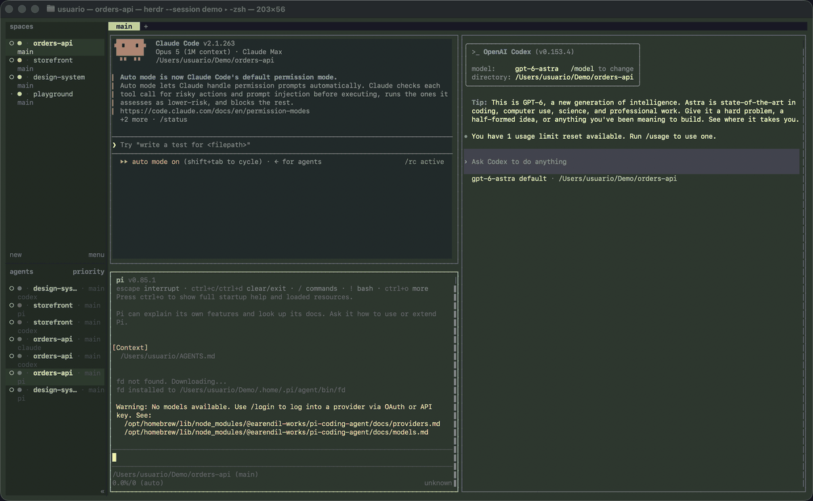
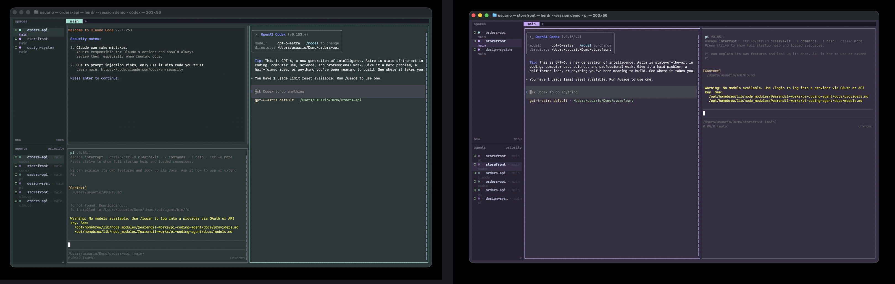
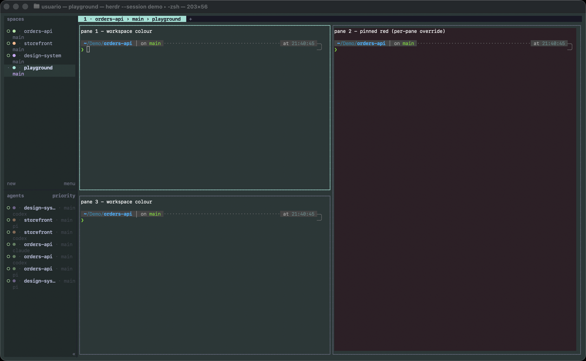

# herdr-plugin-space-colors

Peacock-style per-workspace colours for [Herdr](https://herdr.dev) — the same
idea as the VS Code Peacock extension, for your agent terminals. Each
workspace gets a palette, and three things follow it:

- **The theme.** Accent, sidebar and active-row surfaces switch to the focused
  workspace's colour.
- **The sidebar.** Every agent row and every Space row carries a coloured
  marker (`●`) in its workspace's colour, so you never mistake one agent for
  another. One agent can be pinned to its own colour.
- **The panes.** Each pane's background is tinted with its workspace's colour —
  agent panes included — via a one-line shell hook.
- **The window.** The terminal window itself, title bar included, takes the
  workspace's colour (Apple Terminal today; other emulators are
  [help wanted](https://github.com/ferretorres/herdr-plugin-space-colors/issues/1)).

Explicit rules pin a colour to a project; everything else is coloured
automatically from its directory, so the same project gets the same colour on
every machine with no setup.



*Focus moves across three workspaces. The theme, the sidebar dots, the panes
and the Terminal title bar all follow the focused workspace.*

## Feature tour

**One palette, four surfaces.** Assign a workspace a colour and it shows up in
four places at once, so the active project is unmistakable:



| Surface | What changes | Mechanism |
|---|---|---|
| **Theme** | Accent, sidebar and active-row surfaces of the focused workspace | `[theme.custom]` rewritten on `workspace.focused`, applied live |
| **Sidebar dots** | A coloured `●` on every agent row and Space row, in its workspace's colour | one custom `$token` per palette, reported per pane and Space |
| **Panes** | Each pane background, agent panes included | OSC 11 from a one-line shell hook |
| **Window** | The terminal window and its title bar | AppleScript on the Terminal tab hosting the client (macOS) |

**Pin one pane or one agent to a different colour.** A single pane can carry
its own colour, so you never confuse two agents in the same project:



Pin a long-running or dangerous agent with
`herdr-space-colors set-agent <pane-id> red`: its sidebar dot and its pane both
turn red while the rest of the workspace keeps its colour.

**Or pick from the right-click menu.** Right-click a workspace for
**Colour: Red / Green / …** (it saves the same rule `set` would), or right-click
a pane for **Pin: Red / …** to pin that agent. Each menu ends with a clear entry
that returns to automatic colouring. The eight built-in palettes appear; custom
palettes defined in your config stay CLI-only, because herdr reads a plugin's
actions from its manifest at install time.

## Install

```bash
herdr plugin install ferretorres/herdr-plugin-space-colors
```

The install provisions a small binary once. On macOS (arm64/x86_64) and Linux
(x86_64/arm64) it downloads a prebuilt binary for your platform and verifies
its SHA-256, so **no Rust toolchain is needed**. On any other platform, or from
a local checkout, it builds from source (`cargo` on your PATH —
[rustup.rs](https://rustup.rs)). After that there are no runtime dependencies.
Switch workspaces: the theme and the sidebar markers follow.

For the pane tint and the commands with arguments, put the tool on your PATH
and add the shell hook:

```bash
cd "$(herdr plugin config-dir ferretorres.space-colors)/../../github"/herdr-plugin-space-colors-*
sh bin/herdr-space-colors install-cli          # symlinks ~/.local/bin/herdr-space-colors
herdr-space-colors shell-hook --write          # appends a guarded 3-line hook to ~/.zshrc
```

New panes tint themselves from then on; panes that already exist keep their
colour until they are recreated.

To pin a release: `herdr plugin install ferretorres/herdr-plugin-space-colors --ref v0.3.3`.
For local development, clone and `herdr plugin link ./herdr-plugin-space-colors`.
Herdr picks up manifest *action* changes to a linked plugin immediately, but
registers *event* subscriptions at link time — after editing `[[events]]`, run
`herdr plugin unlink ferretorres.space-colors` and link again, or the new hooks
never fire.

## How it works

Herdr's theme is global to a session, and its socket API has no per-workspace
colour call. Three documented mechanisms, combined, give the effect:

1. **Theme follows focus.** Exactly one workspace is focused at a time. On
   every `workspace.focused` event the plugin writes that workspace's palette
   into `[theme.custom]` in herdr's `config.toml` and runs
   `herdr server reload-config`, which herdr applies live — no restart.
2. **Sidebar tokens.** Row styling is fixed per token position, but *which*
   custom `$token` has a value is dynamic. The plugin writes one token per
   palette into `ui.sidebar.agents.rows` / `ui.sidebar.spaces.rows`, each
   styled in its palette's accent, and reports exactly the matching token on
   every pane and Space with `herdr pane|workspace report-metadata`.
3. **OSC 11.** Herdr honours the "set default background" sequence per pane,
   and every pane — agent panes too — starts inside a login shell. The hook
   runs `herdr-space-colors osc`, which prints the sequence for the calling
   pane's colour. It survives server restarts because restore recreates the
   shell.
4. **Window tint.** The window chrome belongs to the terminal emulator, not to
   herdr. The plugin finds the emulator tab whose tty hosts the herdr client
   and sets its background through the emulator's own interface: AppleScript
   on Apple Terminal, which also paints the title bar from that colour. The
   colour seen first is saved and restored exactly on `clear`, on a switch to
   the base theme, or when the client goes away.

This means the plugin edits a file you maintain by hand. See [Safety](#safety).

## Configuration

The plugin seeds its config on first run: `herdr plugin config-dir ferretorres.space-colors`.

```toml
auto = true                 # hash unmatched workspaces onto the palettes

[sidebar]
enabled = true              # manage the sidebar rows (skipped if you defined your own)
marker = "●"

[pane]
tint = true                 # `osc` tints panes; false prints a reset instead

[[workspaces]]              # pin by exact label, or by path prefix (longest wins,
path = "~/projects/api"     # so every worktree of a project shares its colour)
palette = "blue"

[[workspaces]]
label = "Website"
palette = "green"

[[agents]]                  # pin one agent by its session id (survives restarts)
session = "e2792e1e-c279-4618-91be-69c3cfa5b447"
palette = "yellow"

[palettes.blue]             # keys are theme.custom tokens; values #rgb / #rrggbb
accent = "#89b4fa"
sidebar_bg = "#1f2535"
active_row_bg = "#283248"
# pane_bg = "#1b2030"       # optional; the pane tint defaults to sidebar_bg
[palettes.blue.light]       # used when herdr runs a light theme
accent = "#1e66f5"
sidebar_bg = "#dfe6f8"
active_row_bg = "#cddaf4"
```

Eight palettes tuned for catppuccin (dark and latte) ship in
[`config.example.toml`](./config.example.toml): red, peach, yellow, green,
teal, blue, mauve, pink. Light variants are picked when `theme.name` contains
`latte`, `light`, `dawn`, `day`, `lotus` or `paper`. With `theme.auto_switch`
the host appearance is not visible to plugins, so dark palettes are used;
`status` says so.

Allowed tokens (herdr 0.8.2): `accent`, `panel_bg`, `sidebar_bg`,
`active_row_bg`, `selection_bg`, `surface0`, `surface1`, `surface_dim`,
`overlay0`, `overlay1`, `text`, `subtext0`, `mauve`, `green`, `yellow`, `red`,
`blue`, `teal`, `peach`. Anything else is refused before it reaches your config.
Sidebar rows allow 16 tokens, so keep to 14 palettes when `sidebar.enabled`.

## Commands

Plugin actions (no arguments):

```bash
herdr plugin action invoke ferretorres.space-colors.apply    # theme + sidebar tags for the focused workspace
herdr plugin action invoke ferretorres.space-colors.sweep    # refresh sidebar tags only
herdr plugin action invoke ferretorres.space-colors.clear    # remove everything the plugin wrote
herdr plugin action invoke ferretorres.space-colors.status
```

CLI (after `install-cli`):

```bash
herdr-space-colors set ProSeg mauve            # workspace → palette, persisted as a rule
herdr-space-colors set ~/projects/api blue     # path rule
herdr-space-colors unset ProSeg
herdr-space-colors set-agent wD:p7 yellow      # one agent, by pane id or session id
herdr-space-colors unset-agent wD:p7
herdr-space-colors focus EduCore               # focus a workspace by label
herdr-space-colors palettes
herdr-space-colors status                      # every workspace and pane: palette and why
herdr-space-colors apply --dry-run             # prints the diff, writes nothing
herdr-space-colors clear --dry-run
herdr-space-colors validate
herdr-space-colors osc [--pane ID] [--reset]   # the OSC 11 sequence for a pane
```

`apply` also runs as a startup hook, and `sweep` runs on `workspace.created`
and `pane.agent_status_changed` so new workspaces and agents are tagged
without waiting for a focus change.

## Safety

The plugin writes to your herdr `config.toml`. The contract:

- **Format-preserving edits** via `toml_edit`; comments, key order and
  formatting survive.
- **Only its own keys.** Palette tokens under `[theme.custom]`, and the two
  sidebar `rows` keys — the latter only when you have not set them yourself.
  It only ever removes what it wrote.
- **Strict validation first.** Token allowlist and `#rgb`/`#rrggbb` colours.
  `herdr config check` accepts malformed colours, so the plugin checks itself.
- **One-time backup** to `config.toml.space-colors.bak` before its first edit.
- **Verify, then roll back.** `herdr config check` after every write; on
  failure the previous bytes are restored and a toast tells you.
- **Atomic writes** and a **lock** so two fast focus events cannot race.
- **`clear` gets you back.** Removes the managed keys, the managed rows and
  every sidebar token; a config the plugin created from scratch comes back
  byte-identical.

The shell hook is three guarded lines: it runs only inside a herdr pane
(`HERDR_PANE_ID`), only on a terminal, and only if the CLI is installed.

## Uninstall

```bash
herdr plugin action invoke ferretorres.space-colors.clear
herdr plugin uninstall ferretorres.space-colors
```

Then remove the hook from `~/.zshrc` (marked `# herdr-space-colors shell hook`)
and `~/.local/bin/herdr-space-colors`. Runtime state lives under
`~/.local/state/herdr/plugins/ferretorres.space-colors/`.

## Limitations

- The theme is one at a time: the focused workspace decides the chrome
  colour. Unfocused workspaces are distinguished by their sidebar markers.
- Sidebar row settings affect the expanded desktop sidebar only (herdr keeps
  collapsed and mobile layouts compact).
- Agents with a `ui.sidebar.agents.rows_by_agent` override use that override,
  which will not carry the colour token unless you add it.
- Pane tint needs the shell hook; a pane created before the hook keeps its
  colour until recreated. Panes running non-zsh shells need the equivalent
  hook in their own rc file.
- Sidebar tags are refreshed on `workspace.focused`, `workspace.created` and
  `pane.agent_status_changed` (all verified firing on herdr 0.8.2). A pane
  whose agent never changes state is still tagged on the next focus change.
- Window tint works on Apple Terminal only for now; on other emulators it is
  a silent no-op. macOS may ask once to allow Terminal automation. Adding
  iTerm2, Ghostty, kitty, WezTerm and Alacritty is tracked in
  [#1](https://github.com/ferretorres/herdr-plugin-space-colors/issues/1).
- Built and tested on macOS with herdr 0.8.2. Linux is declared and expected
  to work; reports welcome.

## Contributing

Issues labelled [help wanted](https://github.com/ferretorres/herdr-plugin-space-colors/labels/help%20wanted)
are scoped and ready to pick up: more terminal emulators (#1), bash/fish
hooks (#3), a faster focus path over the socket (#4), and Windows (#6).
CI runs `cargo fmt --check`, `clippy -D warnings`
and the unit tests on Linux and macOS; `sh tests/e2e.sh` needs a running
herdr and checks that apply/clear leaves the config byte-identical.

## Requirements

- Herdr ≥ 0.8.2
- `cargo` only if you install on a platform without a prebuilt
  binary (macOS arm64/x86_64 and Linux x86_64/arm64 are prebuilt); otherwise
  none

## License

MIT — see [LICENSE](./LICENSE).
